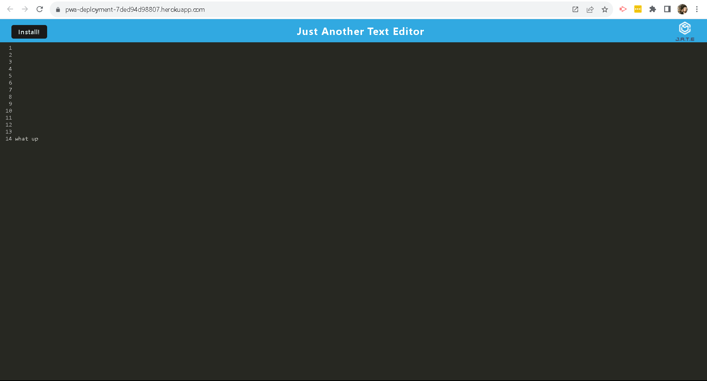

# Unit 19 PWA Homework: Text Editor (Modified Edition)

## Descsription
The main goal of this assignment was to properly set up and configure the web app so it can function as a PWA. the vast majority of the code was provided by the instructor. the files that I worked in are as follows:
- client/src-sw.js
- client/webpack.config.js (done)
- client/src/database.js
- client/src/install.js

## Screen Shot

## Links

* The URL of the deployed application
https://pwa-deployment-7ded94d98807.herokuapp.com/

* The URL of the GitHub repository, with a unique name and a README describing the project
https://github.com/Matt0Stark/pwa_hookup

### Notes from the assignment
- Take a look at the package.json file in the root of the project, and at the scripts object inside it. You will see some new things going on. First, there is an "install" script. When you run `npm install` from the command line, this script will make sure that both of the interior package.json files have their dependencies installed. You'll see this approach used later when we build full MERN apps.

- Notice also a script named "start:dev". It uses a node package called concurrently to start up both your server and client environments at the same time when you are in development. So to test locally, just run `npm start:dev`.

- When you want to test how this will work in production, run `npm start`. Notice that this script then runs a build script in the client environment. In the *client/package.json* file, you'll see that the build script invokes Webpack, and from there Webpack does its thing.

### How to Test

As you develop, you can run things using `npm start:dev`. When you think you have everything completed, then run `npm start`. This will initiate the build process. The app will then be running on port 3000. You'll see a button in the header of the app where you can install it as a PWA. Try it out!

Once everything works locally, deploy to Heroku and test again. You can even test on a mobile device if you want.

If you need to start from scratch and remove the existing PWA:

- Close the standalone browser window containing the PWA
- Delete the PWA from your hard drive 
- Kill the server session running in VS Code 
- In Chrome, go to localhost:3000, the app may or may not open again. If it does, open up the dev console, go to Application -> Service Workerss and click the **Unregister Worker** link.